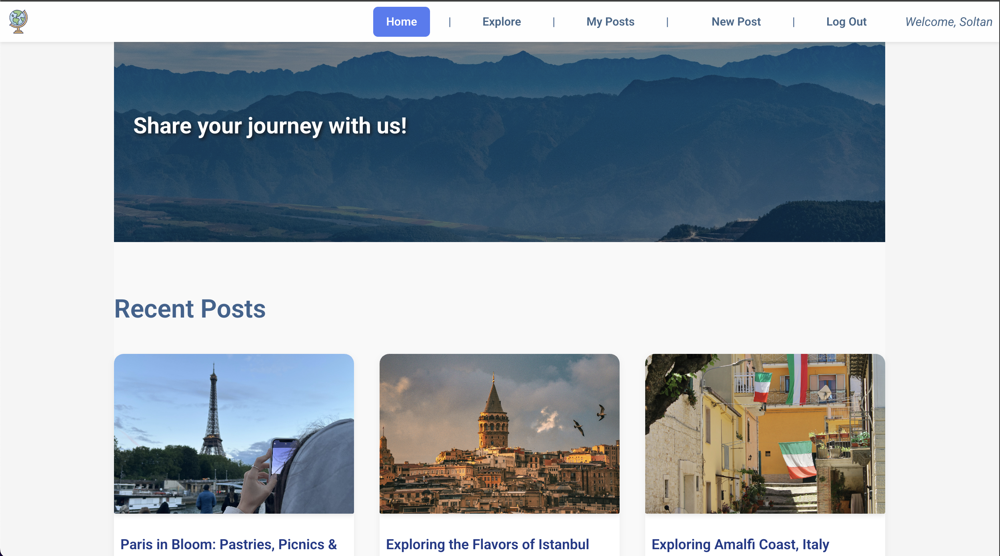
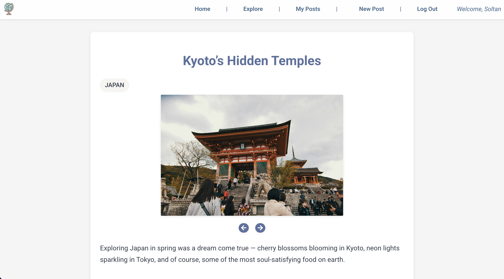
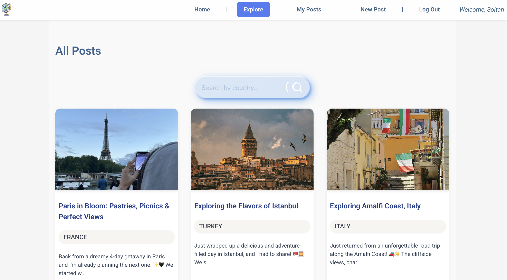

# 🌍 GLOBU

## Welcome to **GLOBU – Your Travel Story Web-App!**

**GLOBU** is a full-stack web app that lets users share travel experiences, browse posts by country, comment on others’ adventures, and discover hidden gems across the globe.

---

## 📷 Screenshots

  
🠠Home Page

| Introduction and recent posts              |
| ------------------------------------------ |
|  |

  
🗺️ Post Details

| Full post content with comments and photos                 |
| ---------------------------------------------------------- |
|  |

  
🔠Search by Country

| Search and filter posts interactively          |
| ---------------------------------------------- |
|  |

---

## 🖥️ Technologies Used

- 
- 
- 
- 
- 
- 

---

## 🔗 [Live App](https://travel-globu-cc6a6fb5e565.herokuapp.com/)

## 🙌 Attributions

- **Icons**: [React Icons](https://react-icons.github.io/react-icons/)
- **Font**: [Poetsen One – Google Fonts](https://fonts.google.com/specimen/Poetsen+One)
- **Images, Logo & Favicon** : [Unsplash](https://unsplash.com)
- **UI Components**: Search bar and auth forms adapted from [Uiverse.io](https://uiverse.io)
- **Emoji Picker**: [emoji-picker-react](https://www.npmjs.com/package/emoji-picker-react)
- **Image Hosting**: [Amazon Web Services (S3)](https://aws.amazon.com/s3/) for user-uploaded images and post content

---

## 🌱 Next Steps

- 🧳 User profile pages with saved posts
- 🗺️ Map integration for geotagged experiences
- 🔔 Notification system for replies
- Tags, per places/foods
- 🧭 “Popular Destinations” trending panel

---
