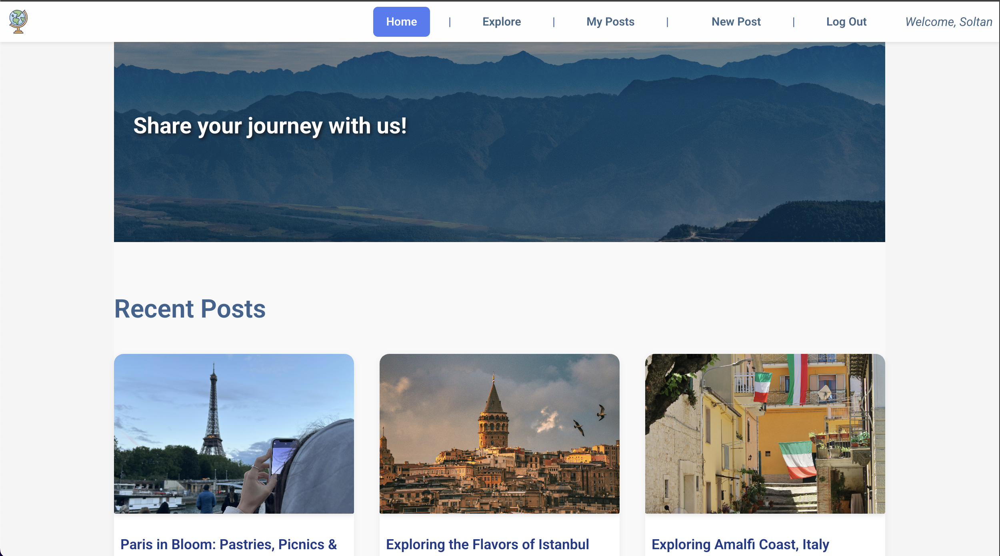
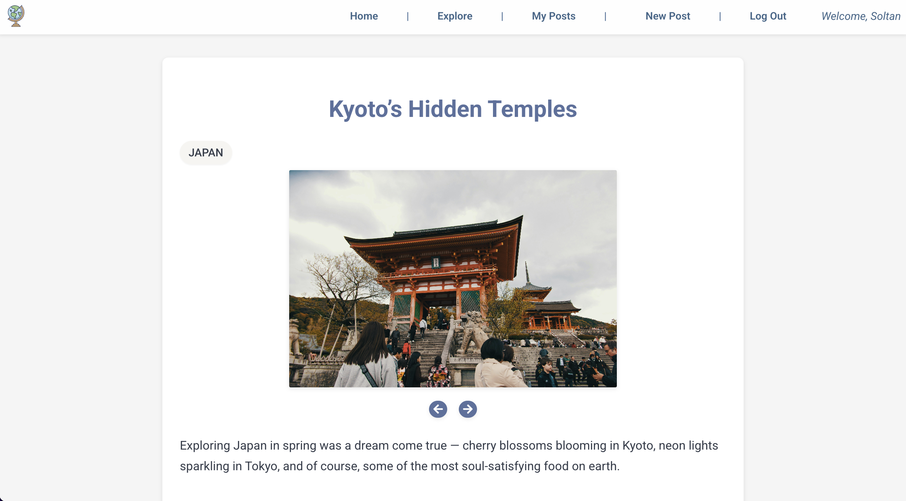
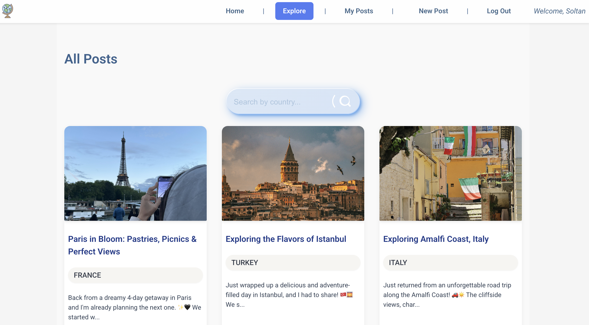

# 🌍 GLOBU

## Welcome to **GLOBU – Your Travel Story Web-App!**

**GLOBU** is a travel-sharing web application that allows users to share their travel experiences, browse posts by country, comment on others’ adventures, and discover hidden gems across the globe.

GLOBU offers a space to:

✈️ Create and publish travel posts with descriptions and images

📍 Filter and browse by country to discover hidden gems

💬 Leave and reply to comments on posts

📷 View user-uploaded travel photos

💡 Why I Built It:

As someone who loves travel and discovering new cultures, I wanted to build a space where people could easily share tips, places, and inspiration, and help each other plan better experiences.Unlike typical travel blogs or guide sites written by companies or influencers, GLOBU is built around real user experiences. Every traveler can:

- Share their trip stories

- Upload photos

- Add personal tips and highlights

- It’s by travelers, for travelers.

---

## 📷 Screenshots

  
🏠 Home Page

| Introduction and recent posts     |
| --------------------------------- |
|  |

  
🗺️ Post Details

| Full post content with comments and photos        |
| ------------------------------------------------- |
|  |

  
🔍 Search by Country

| Search and filter posts interactively |
| ------------------------------------- |
|  |

---

## 🖥️ Technologies Used

- 
- 
- 
- 
- 
- 
- 
- 

---

## Getting Started

## 🔗 [Live App](https://travel-globu-cc6a6fb5e565.herokuapp.com/)

## 🔗 [Planning Materials](https://trello.com/b/kjtarIqa/project-3-%F0%9F%8C%8D-globu)

## 🔗 [ Back-End Repo](https://github.com/ommadova/globu/tree/main/backend)

## 🙌 Attributions

- **Icons**: [React Icons](https://react-icons.github.io/react-icons/)
- **Font**: [Poetsen One – Google Fonts](https://fonts.google.com/specimen/Poetsen+One)
- **Images, Logo & Favicon** : [Unsplash](https://unsplash.com)
- **UI Components**: Search bar and auth forms adapted from [Uiverse.io](https://uiverse.io)
- **Emoji Picker**: [emoji-picker-react](https://www.npmjs.com/package/emoji-picker-react)
- **Image Hosting**: [Amazon Web Services (S3)](https://aws.amazon.com/s3/) for user-uploaded images and post content

---

## 🌱 Next Steps

- 🧳 User profile pages with saved posts
- 🗺️ Map integration for geotagged experiences
- 🔔 Notification system for replies
- Tags, per places/foods
- 🧭 “Popular Destinations” trending panel

---
